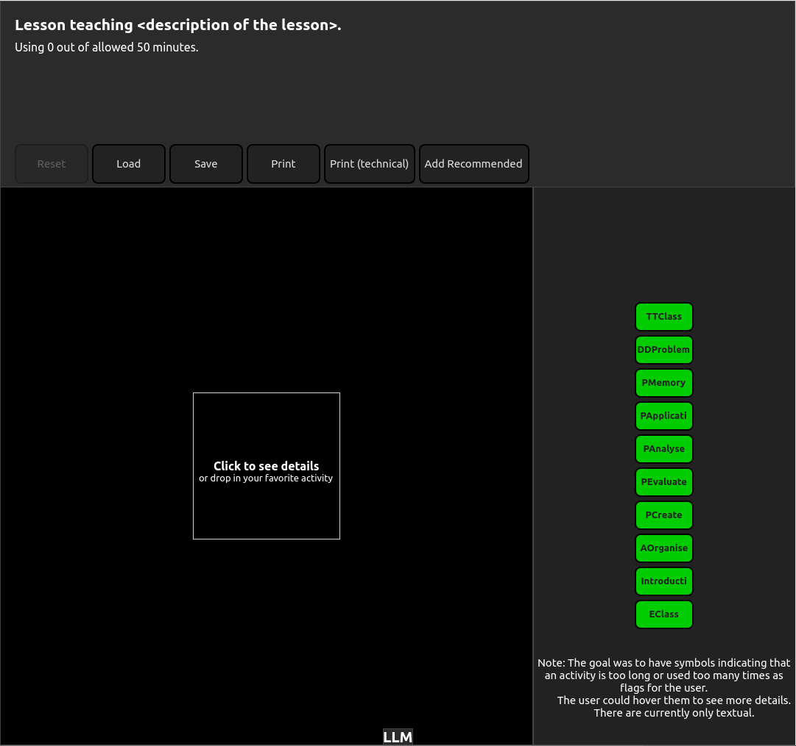

# An Engine producing Orchestration Graphs.

This repository contains my QML application that helps creating Orchestration Graphs. It is part of my semester project done at EPFL with Pr. Dillenbourg during spring 2025, my IN-MA2.

This application uses the engine implemented with Python at the start of the semester. It is an interactive application built with PyQt and QML as this was the framework chosen after a few weeks of testing.

## Reports

The report is available at Reports/Samuel_Belisle_Report.pdf.

## Installation

### Linux (with python - HIGHLY recommended)

If you want to run the application, I recommend using a linux machine which can already run Python code, clone the repository in a new folder and create a new virtual environnement. Within this environnement, you can install all required packages using

\>>> python3 -m pip install -r requirements.txt

This installs all packages listed in the requirements.txt file.

After the installation, you can run the application using

\>>> python3 main.py

### Linux (built version - Not recommended)

If running the code with python fails, you can simply run the executable file I built.
If you are before 6th of July 2025, you can Download the zip archive from SwissTransfer (https://www.swisstransfer.com/d/5e47a67e-8efc-44bc-aad3-27f45ad20af2).
Otherwise, send me an e-mail.
Unzip the BuildForLinux.zip archive on the folder of your choice. Then, you can execute the main.exe file in it and refer to the Run section below.

### Windows (built version - Recommended)

For windows, you can simply run the executable file I built.
Unzip the BuildForWindows.zip archive (from this githup repo) on the folder of your choice. Then, you can execute the main.exe file in it and refer to the Run section below.

### Windows (with python - Not recommended)

Even if I managed to install and run the application using python on Windows, I do not recommend it. Here is what worked for me:

I had to run the following command *outside of a virtual environnement* from a "windows command terminal opened with admin rights*.
\>>> pip install -r requirements.txt

I highly recommend to try first within a good IDE that manages modules or on your normal windows command terminal within a virtual environnement.

After the installation, you can run the application using

\>>> python3 main.py

## Run

You should see something like:

Then, you can drag and drop general actvities (green) from the library to the lesson. Try clicking on the activities and on the "spaces" between the activities in the orchestration graph. Later on, you can see things like:

## Tests

Some files include tests that were useful during developpement. One can run them using

\>>> python3 OrchestrationGraph.py

and

\>>> python3 InstantiatedAct.py

The tests in OrchestrationGraph.py use the external print functionnality which is explained in MyOGPrinter.py. One need to manually press enter to continue the tests after having seen the visual representation.

## Modifications

You can make modifications to the application only if you run it with Python.

If you wish to change the Library of activities, you can edit the inputData/interpolation_2D_library.csv input file.
There are other parameters that can be modified in params.py.
There is also a choice that can be made by commenting/uncommenting return statements in Efficience.py.

## Contact

Please contact me at samuel.belisle@epfl.ch (samuel.belisle@alumni.epfl.ch if after 2026) for any details.